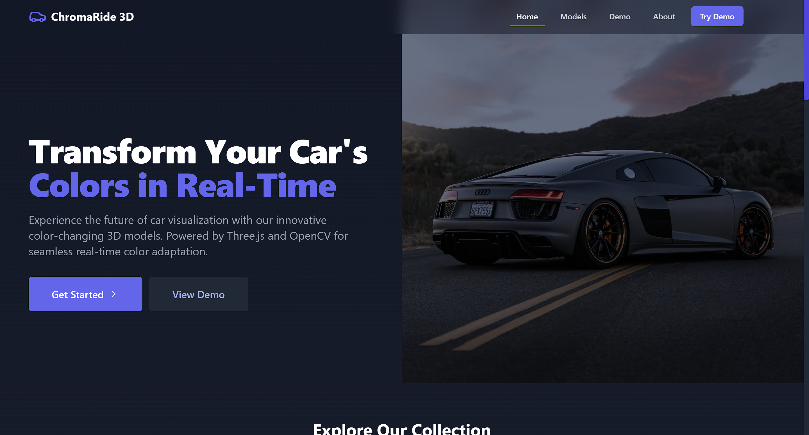
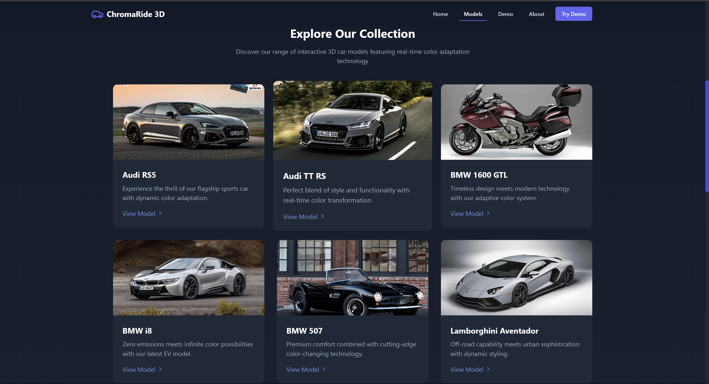
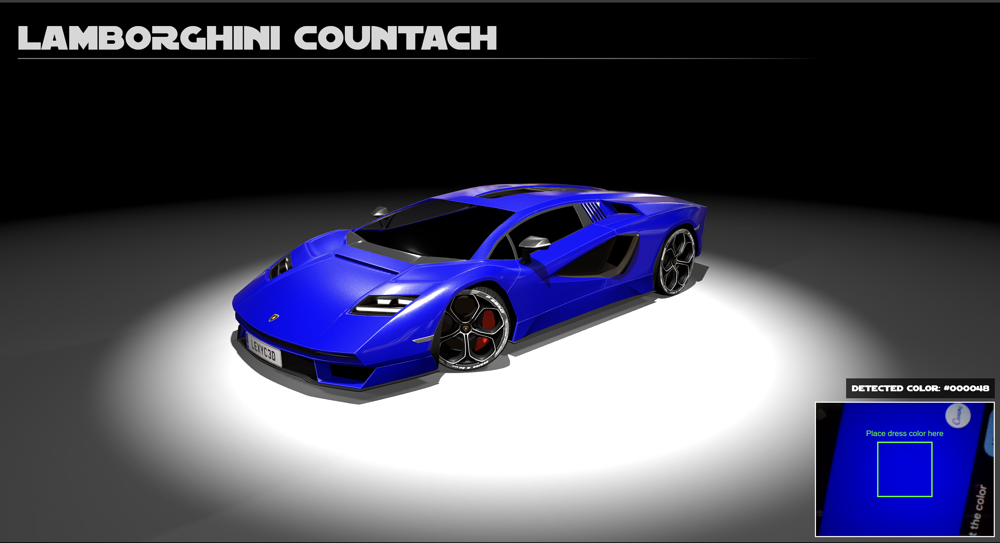
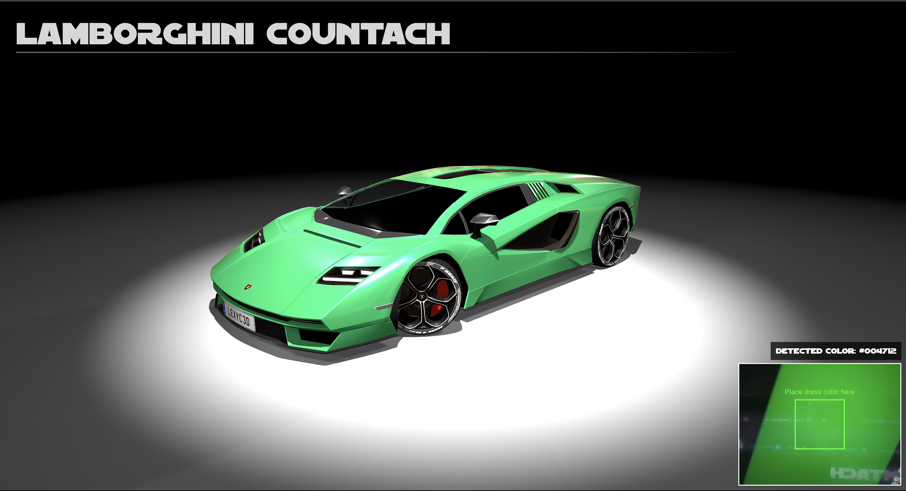
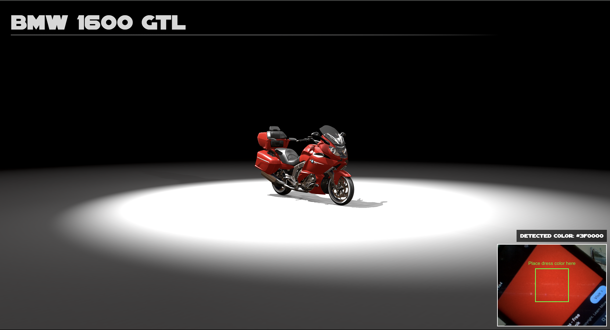
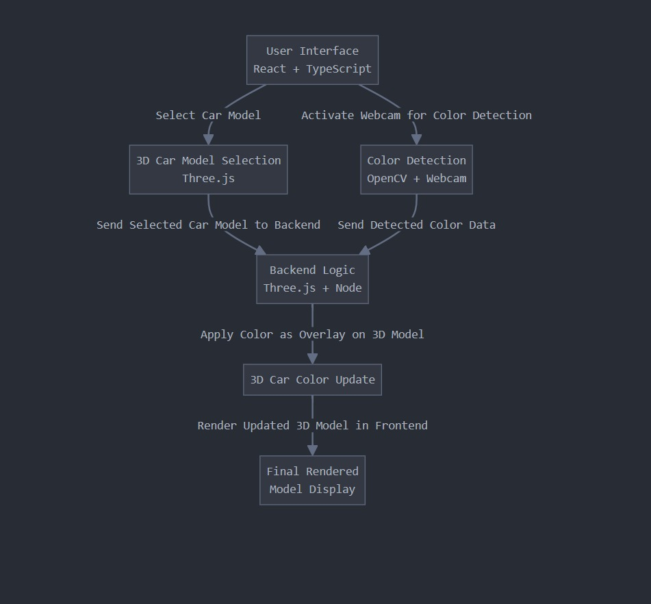

# ChromaRide 3D 🎯


## Basic Details
### Team Name: Xplorers


### Team Members
- Team Lead: Christy Maria Sebastian - St. Joseph's College of Engineering and Technology, Palai.
- Member 2: Anoop Kumar A - St. Joseph's College of Engineering and Technology, Palai.

### Project Description
This project was created as part of the "Useless Projects" hackathon hosted by Tinkerhub. It's a fun experiment using Three.js and OpenCV.js to detect the color of a person's outfit in front of a camera and apply that color to a 3D car model.

### The Problem (that doesn't exist)
In the realm of interactive web experiences, color detection and dynamic visual representation offer exciting possibilities for user engagement.The current limitations of web-based color interaction tools often result in static or pre-defined color schemes, reducing user personalization and interactivity. 

### The Solution (that nobody asked for)
This project aims to address the challenge of integrating real-time color detection with 3D modeling in a web application. By leveraging Three.js and OpenCV.js, the objective is to create an immersive experience where the color of a person's outfit is detected through a webcam and dynamically applied to a 3D car model.. Our project seeks to overcome these limitations by providing a responsive, user-driven approach that transforms the color of a virtual car based on the user's real-time clothing color.

## Technical Details
### Technologies/Components Used
For Software:
- Languages used: JavaScript, TypeScript
- Frameworks used: React, Vite
- Libraries used: Three.js, OpenCV.js
- Tools used: Node.js

For Hardware:
- main components: A computer with a webcam and a stable internet connection
- specifications: Any modern computer capable of running a web browser and supporting Node.js
- tools required: A code editor (like VSCode) and Terminal/command prompt for executing commands


For Software:

#### Installation

1. Clone the repository:
    ```bash
    git clone https://github.com/yourusername/ChromaRide_3D.git
    cd ChromaRide_3D
    ```
2. Install dependencies:
    ```bash
    npm install
    ```

#### Run

1. Start the development server:
    ```bash
    npm run dev
    ```
    This command will run the application locally, allowing you to view changes in real-time.
    
2. Build the project for production:
    ```bash
    npm run build
    ```

3. Deploy to GitHub Pages:
    ```bash
    npm run deploy
    ```

### Project Documentation

For Software:
- **Overview:** This project showcases a 3D car model that changes its color based on the color detected from the user's clothing through the webcam. The application utilizes advanced web technologies for a smooth user experience.

- **File Structure:**
    ```
    /ChromaRide_3D
    ├── /public             # Contains static files and 3D models
    ├── /src                # Contains source code
    │   ├── /components     # React components
        ....
    │   └── /main.tsx       # Entry point of the application
    ├── package.json        # Project metadata and dependencies
        ....
    └── README.md           # Project documentation
    ```

- **Usage:** Users can access the application via a web browser. Upon allowing webcam access, the application will detect the dominant color of the user's clothing and update the car model's color in real-time.

- **Contribution:** Contributions are welcome! Please fork the repository and submit a pull request for any enhancements or fixes.

# Screenshots (Add at least 3)

*The main page*


*Our Models*


*Demo 1*


*Demo 2*


*Demo 3*

# Diagrams

*Add caption explaining your workflow*


### Project Demo
# Video

*Demo of the Web app that we've created*


## Team Contributions
- Christy Maria Sebastian: Wored on creating the Main Page of the website.
- Anoop Kumar A: Worked on three.js and opencv.js for colour dectection and model editing.

---
Made with ❤️ at TinkerHub Useless Projects 


